# Blogging_App

A multi-user blogging app where user can post/edit his her blog.

## Features Of App

- Login is Authenticated by Google Sign In feature
- Any user can login and post his/her story in the app.
- Each and every story will be tagged with the currently logged in user details and geolocation
- Every user will be able to see a list of all the stories and their respective details.
- Users are able to filter the stories by author name

## Some Screenshots

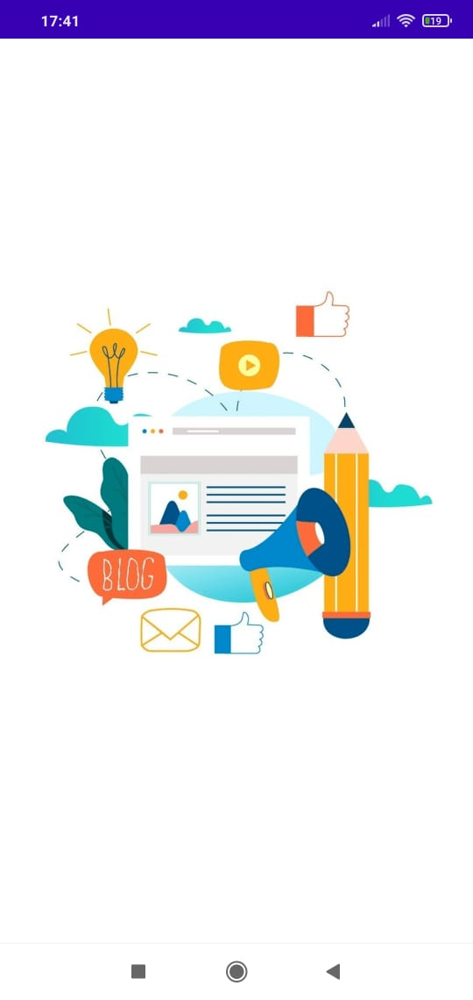  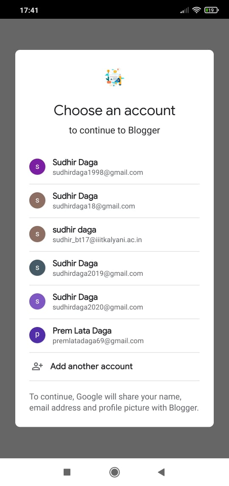 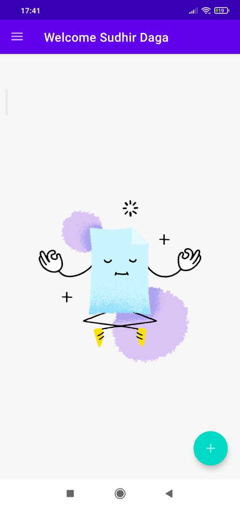 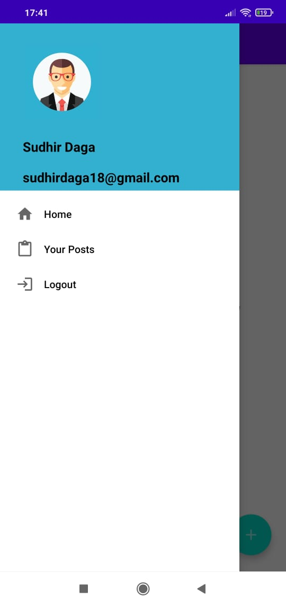 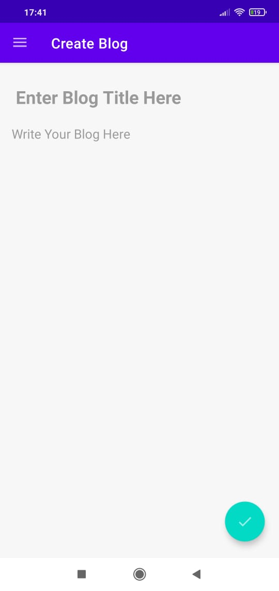 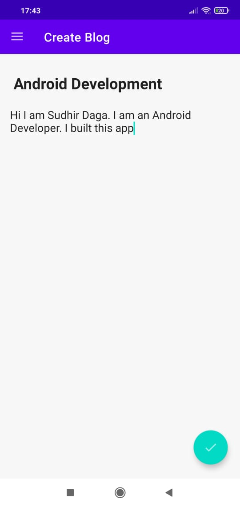 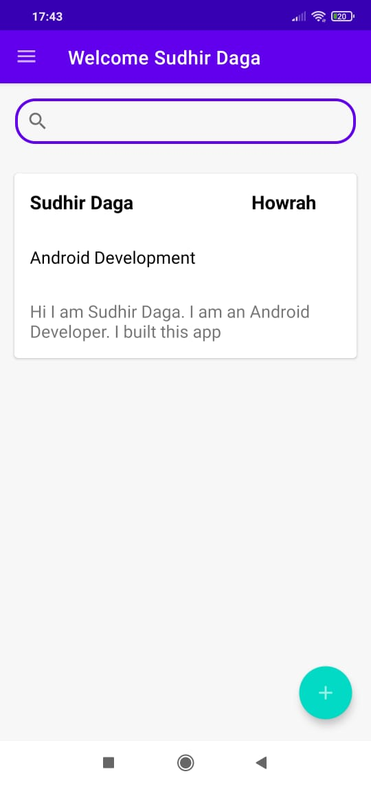 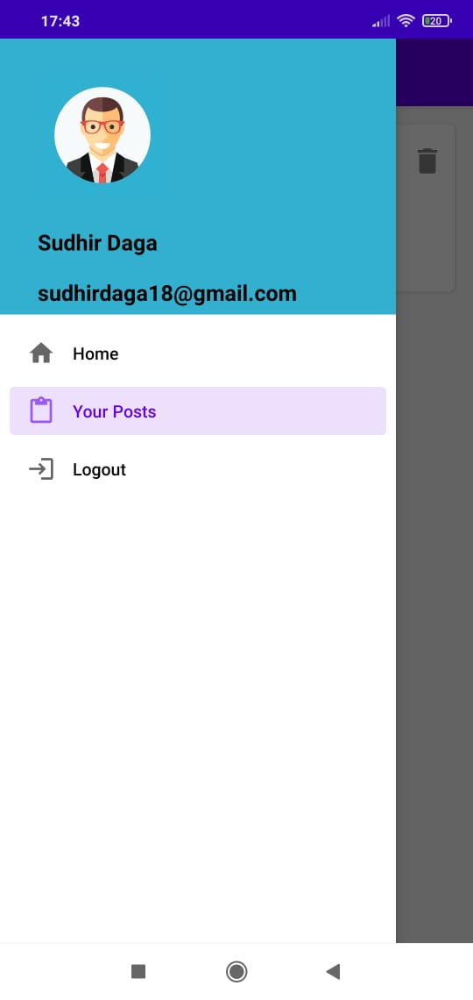 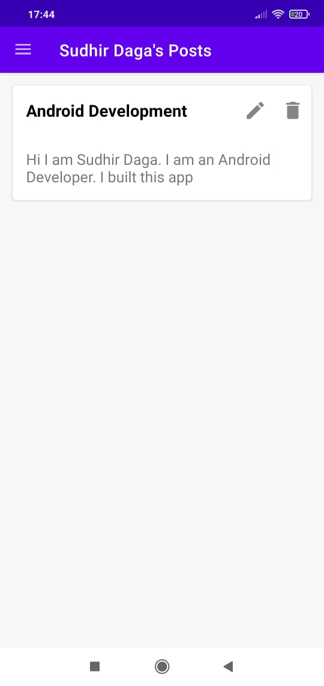 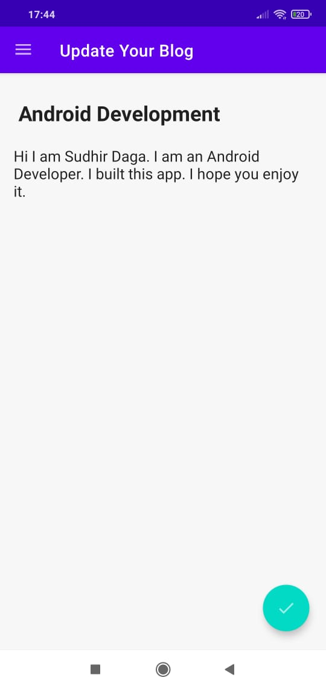  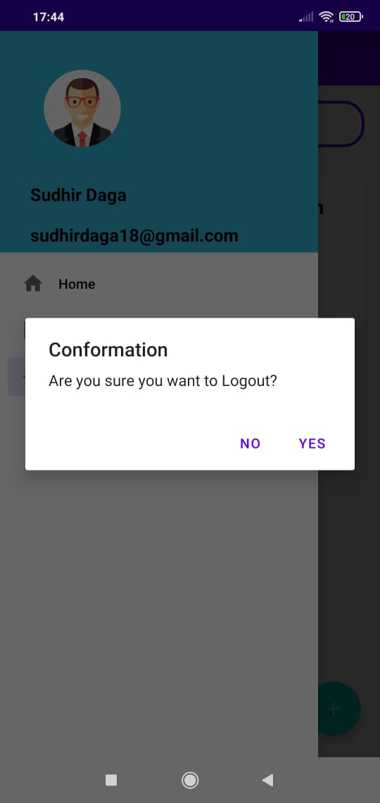 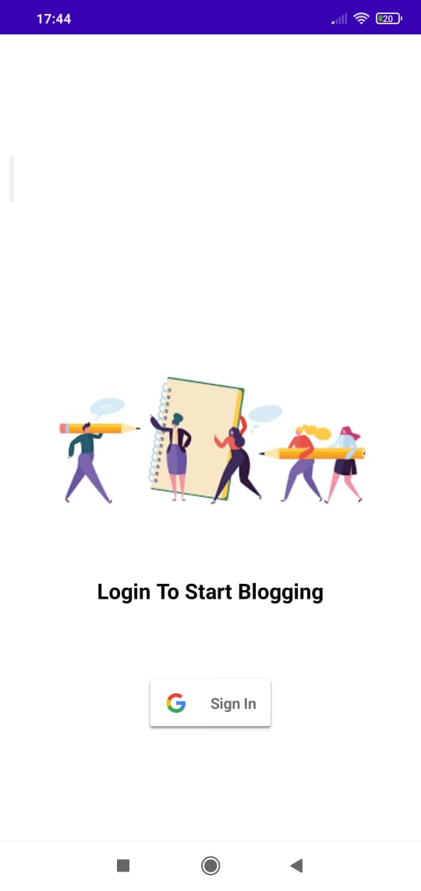  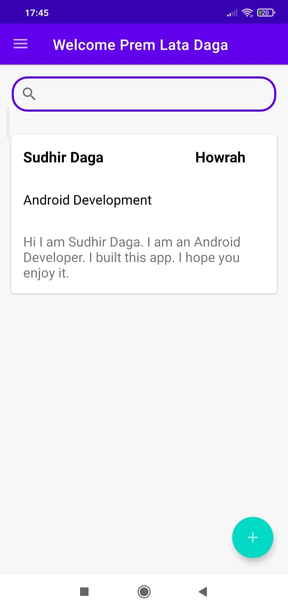 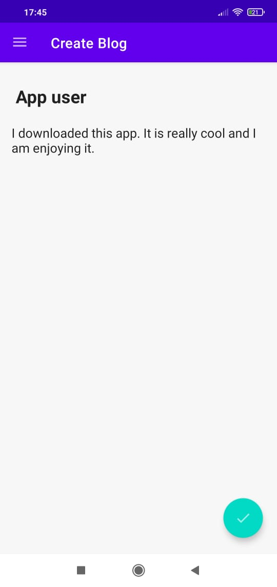 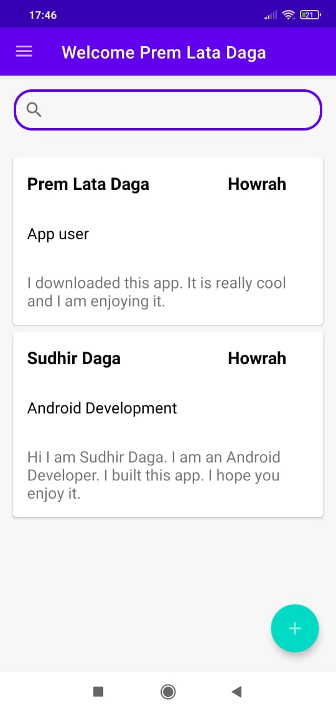 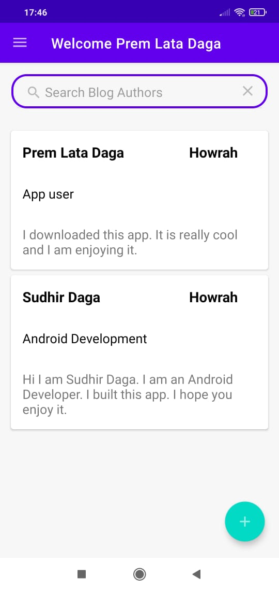 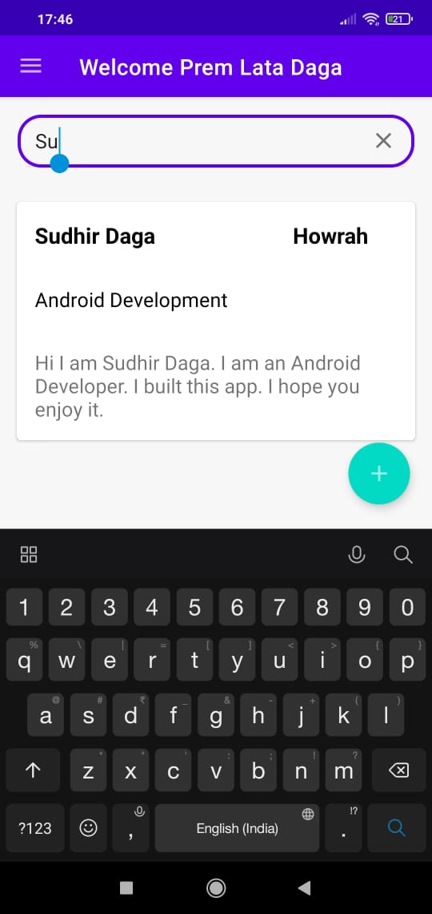
